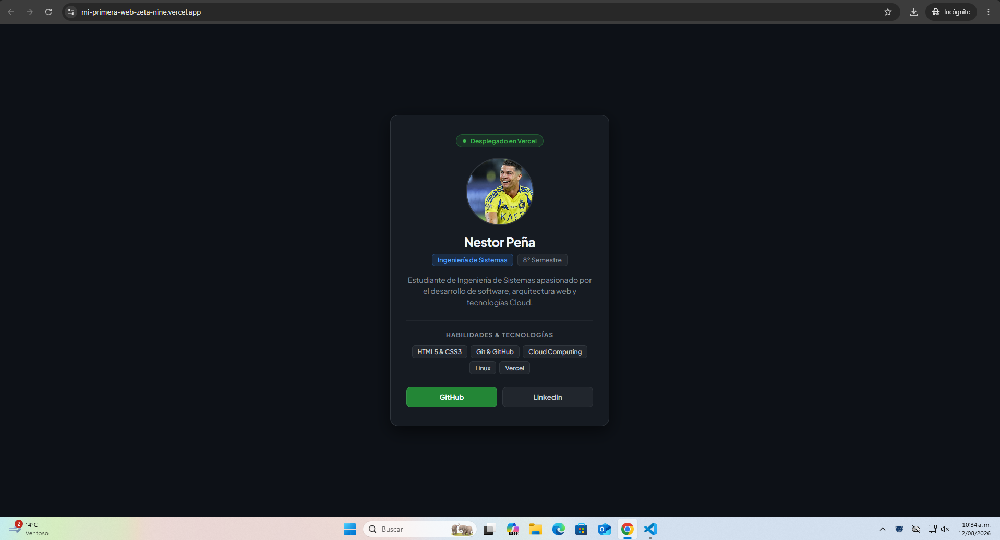
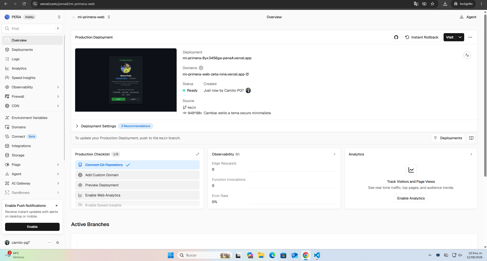

# Reto 1: Hoja de Vida / Carta de Presentación Web

## 📌 Datos del Estudiante
* **Nombre:** Nestor Peña
* **Carrera:** Ingeniería de Sistemas
* **Materia:** Cloud Computing

---

## 🌐 Enlaces del Proyecto
* **URL de la aplicación en producción (Vercel):** [https://mi-primera-web-zeta-nine.vercel.app](https://mi-primera-web-zeta-nine.vercel.app)
* **Repositorio en GitHub:** [https://github.com/Camilo-PG7/mi-primera-web](https://github.com/Camilo-PG7/mi-primera-web)
* **Perfil de LinkedIn:** [Nestor Peña en LinkedIn](https://www.linkedin.com/in/nestor-peña-779547403)

---

## 🛠️ Tecnologías Utilizadas
* **Frontend:** HTML5, CSS3
* **Control de Versiones:** Git & GitHub
* **Despliegue Cloud:** Vercel

---

## 📸 Evidencias de Despliegue

### 1. Vista de la Página Web en Producción

### 2. Panel de Despliegue en Vercel
